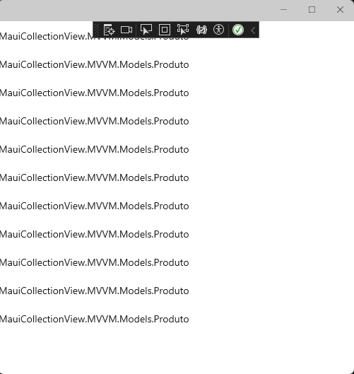
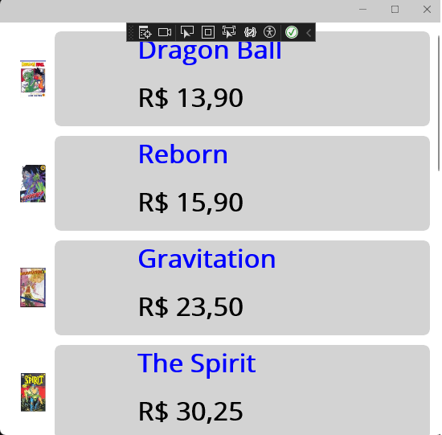

# [.NET MAUI : Apresentando CollectionView - I](https://youtu.be/-XLblm3LRFk?si=nsvHcXKz43VvI1xF)

## Características do CollectionView

1. Suporta seleção única e múltipla
2. Pode ser vinculado ao uma coleção de dados ou a um modelo de dados personalizado
3. Fornece propriedades e eventos para personalizar aparência e comportamento
4. Usa virtualização, ou seja, somente os itens visiveis são carregados na memória

## Propriedades que definem os dados e sua aparência

1. **ItemsSource** - É um **IEnumerable** que especifica a coleção dados. Tem valor **null** por padrão
   
2. **ItemTemplate** - É um **DataTemplate** que especifica o modelo a ser aplicado a cada item definindo como cada item é exibido. Por exemplo, em uma coleção de dados da classe Pessoa, cada pessoa tem propriedades como Nome, Idade, Sexo, etc. O DataTemplate tem objetos que podem associar-se a cada uma das propriedades da classe Pessoa, definindo assim a forma como elas são exibidas na lista.
   
3. O código abaixo mostra um exemplo de uso da propriedade **ItemsSource**

```
<CollectionView>
    <CollectionView.ItemsSource>
        <x:Array Type="{x:Type x:String}">
            <x:String>Santos</x:String>
            <x:String>Palmeiras</x:String>
            <x:String>Flamengo</x:String>
            <x:String>São Paulo</x:String>
            <x:String>Internacional</x:String>
            <x:String>Atlético-PR</x:String>
        </x:Array>
    </CollectionView.ItemsSource>
</CollectionView>
```

4. Execultando o código acima teremos o seguinte resultado

<p align="center"></p>  

## Exemple prático com **DataBinding** e **arquitetura MVVM**

1. No diretório raiz crie a pasta **MVVM**
2. Dentro da pasta *MVVM* crie as seguintes pastas: Models, ViewModels, Views
3. Na pasta **Models**, crie o arquivo **Produto.cs** com o seguinte código:
   
   ```
    namespace MauiCollectionView.MVVM.Models
    {
        public class Produto
        {
            public string Nome { get; set; }
            public decimal Preco { get; set; }
            public string Imagem { get; set; }
            public int Estoque { get; set; }
            public bool EmOferta { get; set; }
        }
    }
   ```

4. Na pasta **ViewModels**, crie o arquivo ProdutoViewModel.cs com o seguinte código:

```
using MauiCollectionView.MVVM.Models;
using System.Collections.ObjectModel;

namespace MauiCollectionView.MVVM.ViewModels
{
    public class ProdutoViewModel
    {
        public ObservableCollection<Produto> Produtos { get; set; }

        public ProdutoViewModel()
        {
            CriarProdutor();
        }

        private void CriarProdutor()
        {
            Produtos = new ObservableCollection<Produto>
            {
                 new Produto
                 {
                    Nome = "Dragon Ball",
                    Preco = 13.90m,
                    Imagem = "dragonball1.jpg",
                    EmOferta = false,
                    Estoque = 10
                 },
                 new Produto
                 {
                    Nome = "Reborn",
                    Preco = 15.90m,
                    Imagem = "rebon1.jpg",
                    EmOferta = false,
                    Estoque = 5
                 },
                 new Produto
                 {
                    Nome = "Gravitation",
                    Preco = 23.50m,
                    Imagem = "gravitation1.jpg",
                    EmOferta = true,
                    Estoque = 3
                 },
                 new Produto
                 {
                    Nome = "The Spirit",
                    Preco = 30.25m,
                    Imagem = "spirit1.jpg",
                    EmOferta = false,
                    Estoque = 10
                 },
                 new Produto
                 {
                    Nome = "Sakura",
                    Preco = 10.45m,
                    Imagem = "sakura1.jpg",
                    EmOferta = false,
                    Estoque = 4
                 },
                 new Produto
                 {
                    Nome = "Naruto",
                    Preco = 21.50m,
                    Imagem = "naruto1.jpg",
                    EmOferta = true,
                    Estoque = 5
                 },
                 new Produto
                 {
                    Nome = "Orquídea Negra",
                    Preco = 30.40m,
                    Imagem = "orquideanegra1.jpg",
                    EmOferta = false,
                    Estoque = 7
                 },
                 new Produto
                 {
                    Nome = "Lovehina",
                    Preco = 10.99m,
                    Imagem = "lovehina1.jpg",
                    EmOferta = true,
                    Estoque = 2
                 },
                 new Produto
                 {
                    Nome = "Inu Yasha",
                    Preco = 12.60m,
                    Imagem = "inuyasha1.jpg",
                    EmOferta = false,
                    Estoque = 2
                 },
                 new Produto
                 {
                    Nome = "Negima",
                    Preco = 15.90m,
                    Imagem = "negina1.jpg",
                    EmOferta = false,
                    Estoque = 6
                 },
                 new Produto
                 {
                    Nome = "SuperOne",
                    Preco = 9.70m,
                    Imagem = "superone1.jpg",
                    EmOferta = true,
                    Estoque = 5
                 }
            };
        }
    }
}

```

5. Na pasta **Views**, crie o arquivo **ProdutoView.xaml**, usando o seguinte template: **.NET MAUI ContentPage (XAML)**
   
6. No arquivo **ProdutoView.xaml.cs**, faça a seguinte modificação
   
```
using MauiCollectionView.MVVM.ViewModels;

namespace MauiCollectionView.MVVM.Views;

public partial class ProdutoView : ContentPage
{
	public ProdutoView()
	{
		InitializeComponent();
		BindingContext = new ProdutoViewModel();
	}
}
```   

7. No arquivo **App.xaml.cs** faça a seguinte modificação:

```
using MauiCollectionView.MVVM.Views;

namespace MauiCollectionView
{
    public partial class App : Application
    {
        public App()
        {
            InitializeComponent();
            MainPage = new ProdutoView();
        }
    }
}
```

8. Edite o arquivo **ProdutoView.xaml** da seguinte forma:
   
```
<?xml version="1.0" encoding="utf-8" ?>
<ContentPage xmlns="http://schemas.microsoft.com/dotnet/2021/maui"
             xmlns:x="http://schemas.microsoft.com/winfx/2009/xaml"
             x:Class="MauiCollectionView.MVVM.Views.ProdutoView"
             Title="ProdutoView">

    <CollectionView ItemsSource="{Binding Produtos}" />

</ContentPage>
```

9. Execultando o código acima teremos o seguinte resultado

<p align="center"></p>  

## Trabalhando com Collection.ItemTemplate

1. Edit o arquivo **ProdutoView.xaml** como mostrado logo abaixo

```
<?xml version="1.0" encoding="utf-8" ?>
<ContentPage xmlns="http://schemas.microsoft.com/dotnet/2021/maui"
             xmlns:x="http://schemas.microsoft.com/winfx/2009/xaml"
             x:Class="MauiCollectionView.MVVM.Views.ProdutoView"
             Title="ProdutoView">

    <CollectionView ItemsSource="{Binding Produtos}">
        <CollectionView.ItemTemplate>
            <DataTemplate>
                <Grid Margin="15, 10, 15, 0"
                      ColumnDefinitions=".1*, .2*, .7*"
                      RowDefinitions="*,*">
                    <Frame
                        Grid.RowSpan="2"
                        Grid.Column="1"
                        Grid.ColumnSpan="2"
                        BackgroundColor="LightGray"
                        BorderColor="White">
                    </Frame>

                    <Image 
                        Grid.RowSpan="2"
                        Margin="10"
                        HeightRequest="100"
                        Source="{Binding Imagem}" />

                    <Label
	                    Grid.Column="2"
	                    FontSize="Large"
	                    FontAttributes="Bold"
	                    TextColor="Blue"
	                    Text="{Binding Nome}"
	                    VerticalOptions="Start" />

                    <Label
	                    Grid.Column="2"
	                    Grid.Row="1"                        
	                    FontSize="Large"
	                    FontAttributes="Bold"
	                    TextColor="Black"
	                    Text="{Binding Preco, StringFormat='{0:C}'}"
	                    VerticalOptions="Start" />
                </Grid>
            </DataTemplate>
        </CollectionView.ItemTemplate>
    </CollectionView>

</ContentPage>
```

2. Execute a aplicação e veja o seguite resultado
   
<p align="center"></p>  

## ResourceDictionary

1. Na pasta **Resource/Styles** Crie o arquivo **CollectionViewDictionary**
   1. Escolha a opção ".NET MAUI ResourceDictionary (XAML)
   2. Exclua o arquivo **CollectionViewDictionary.xaml.cs**
   3. Edite o **CollectionViewDictionary.xaml** para ficar neste formato:
   
        ```
        <?xml version="1.0" encoding="utf-8" ?>
        <?xaml-comp compile="true" ?>
        <ResourceDictionary xmlns="http://schemas.microsoft.com/dotnet/2021/maui"
                    xmlns:x="http://schemas.microsoft.com/winfx/2009/xaml">

            Colocar aqui o DataTemplate

        </ResourceDictionary>        
        ```

    4. No arquivo **ProductView.xaml**, recorte o DataTemplate e coloque no arquivo **CollectionViewDictionary.xaml**
    5. Addione  **x:Key="ProdutosStyle"** and DataTemplate
   
2. Inclua o Resource dictionary no arquivo **App.xaml** como é mostrado no código seguinte:

    ```
    <?xml version = "1.0" encoding = "UTF-8" ?>
    <Application xmlns="http://schemas.microsoft.com/dotnet/2021/maui"
                xmlns:x="http://schemas.microsoft.com/winfx/2009/xaml"
                xmlns:local="clr-namespace:MauiCollectionView"
                x:Class="MauiCollectionView.App">
        <Application.Resources>
            <ResourceDictionary>
                <ResourceDictionary.MergedDictionaries>
                    <ResourceDictionary Source="Resources/Styles/Colors.xaml" />
                    <ResourceDictionary Source="Resources/Styles/Styles.xaml" />
                    <ResourceDictionary Source="Resources/Styles/CollectionViewDictionary.xaml" />
                </ResourceDictionary.MergedDictionaries>
            </ResourceDictionary>
        </Application.Resources>
    </Application>
    ```

3. Definir a propriedade **ItemTemplate** no arquivo **ProductView.xaml** mostrado no código seguinte:
   
   ```
   <CollectionView ItemsSource="{Binding Produtos}"
                ItemTemplate="{StaticResource ProdutosStyle}">
    </CollectionView>
   ```

## DataTemplateSelector

O **DataTemplateSelector** permite selecionar ou trocar um DataTemplate dinamicamente em tempo de execução.

Para tornar isso possível é necessário realizar dois passas

1. Criar uma classe que herde de **DataTemplateSelector**
2. Sobrescrever o método **OnSelectorTemplate** para retornar um DataTemplate específico

### Aplicando DataTemplateSelector

1. Abra o arquivo **CollectionViewDictionary.xaml** e crie outro DataTemplate chamado **EmOfertaStyle** como mostra o código seguinte:
   
    ```
    <DataTemplate x:Key="EmOfertaStyle">
        <Grid Margin="15, 10, 15, 0"
          ColumnDefinitions=".1*, .2*, .7*"
          RowDefinitions="*,*">
            <Frame
            Grid.RowSpan="2"
            Grid.Column="1"
            Grid.ColumnSpan="2"
            BackgroundColor="LightGray"
            BorderColor="LightCoral">
            </Frame>

            <Image 
            Grid.RowSpan="2"
            Margin="10"
            HeightRequest="100"
            Source="{Binding Imagem}" />

            <Label
            Grid.Column="2"
            FontSize="Large"
            FontAttributes="Bold"
            TextColor="Blue"
            Text="{Binding Nome, StringFormat='OFERTA: {0}'}"
            VerticalOptions="Start" />

            <Label
            Grid.Column="2"
            Grid.Row="1"                        
            FontSize="Large"
            FontAttributes="Bold"
            TextColor="Black"
            Text="{Binding Preco, StringFormat='{0:C}'}"
            VerticalOptions="Start" />
        </Grid>
    </DataTemplate>

    ```

2. No diretório raiz crie a pasta **Selectors**
3. Dentro da pasta Selectors addicione a classe **ProdutoDataTemplateSelector** com seguinte implementação:
   
    ```
    using MauiCollectionView.MVVM.Models;

    namespace MauiCollectionView.Selectors
    {
        class ProdutoDataTemplateSelector : DataTemplateSelector
        {
            protected override DataTemplate OnSelectTemplate(object item, BindableObject container)
            {
                var produto = item as Produto;

                if (!produto.EmOferta)
                {
                    Application.Current.Resources.TryGetValue("ProdutosStyle", out var produtoStyle);
                    return produtoStyle as DataTemplate;
                }
                else
                {
                    Application.Current.Resources.TryGetValue("EmOfertaStyle", out var emOfertaStyle);
                    return emOfertaStyle as DataTemplate;

                }
            }
        }
    }    
    ```

4. AAA


<!--
# .NET MAUI : Apresentando CollectionView - I
## DataTemplateSelector
### Aplicando DataTemplateSelector

## Características do CollectionView
## Propriedades que definem os dados e sua aparência
## Exemple prático com DataBinding e arquitetura MVVM
## Trabalhando com Collection.ItemTemplate
## ResourceDictionary
## DataTemplateSelector
### Aplicando DataTemplateSelector
-->