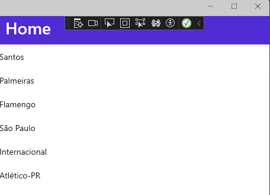

# [.NET MAUI : Apresentando CollectionView - I](https://youtu.be/-XLblm3LRFk?si=nsvHcXKz43VvI1xF)

## Características do CollectionView

1. Suporta seleção única e múltipla
2. Pode ser vinculado ao uma coleção de dados ou a um modelo de dados personalizado
3. Fornece propriedades e eventos para personalizar aparência e comportamento
4. Usa virtualização, ou seja, somente os itens visiveis são carregados na memória

## Propriedades que definem os dados e sua aparência

1. **ItemsSource** - É um **IEnumerable** que especifica a coleção dados. Tem valor **null** por padrão
   
2. **ItemTemplate** - É um **DataTemplate** que especifica o modelo a ser aplicado a cada item definindo como cada item é exibido. Por exemplo, em uma coleção de dados da classe Pessoa, cada pessoa tem propriedades como Nome, Idade, Sexo, etc. O DataTemplate tem objetos que podem associar-se a cada uma das propriedades da classe Pessoa, definindo assim a forma como elas são exibidas na lista.
   
3. O código abaixo mostra um exemplo de uso da propriedade **ItemsSource**

```
<CollectionView>
    <CollectionView.ItemsSource>
        <x:Array Type="{x:Type x:String}">
            <x:String>Santos</x:String>
            <x:String>Palmeiras</x:String>
            <x:String>Flamengo</x:String>
            <x:String>São Paulo</x:String>
            <x:String>Internacional</x:String>
            <x:String>Atlético-PR</x:String>
        </x:Array>
    </CollectionView.ItemsSource>
</CollectionView>
```

4. Execultando o código acima teremos o seguinte resultado

<p align="center"></p>  

## Exemple prático com **DataBinding** e **arquitetura MVVM**

1. No diretório raiz crie a pasta **MVVM**
2. Dentro da pasta *MVVM* crie as seguintes pastas: Models, ViewModels, Views
3. Na pasta **Models**, crie o arquivo **Produto.cs** com o seguinte código:
   
   ```
    namespace MauiCollectionView.MVVM.Models
    {
        public class Produto
        {
            public string Nome { get; set; }
            public decimal Preco { get; set; }
            public string Imagem { get; set; }
            public int Estoque { get; set; }
            public bool EmOferta { get; set; }
        }
    }
   ```

4. Na pasta **ViewModels**, crie o arquivo ProdutoViewModel.cs com o seguinte código:

```
using MauiCollectionView.MVVM.Models;
using System.Collections.ObjectModel;

namespace MauiCollectionView.MVVM.ViewModels
{
    public class ProdutoViewModel
    {
        public ObservableCollection<Produto> Produtos;
        public ProdutoViewModel()
        {
            CriarProdutor();
        }

        private void CriarProdutor()
        {
            Produtos = new ObservableCollection<Produto>
            {
                 new Produto
                 {
                    Nome = "Dragon Ball",
                    Preco = 13.90m,
                    Imagem = "dragonball1.jpg",
                    EmOferta = false,
                    Estoque = 10
                 },
                 new Produto
                 {
                    Nome = "Reborn",
                    Preco = 15.90m,
                    Imagem = "rebon1.jpg",
                    EmOferta = false,
                    Estoque = 5
                 },
                 new Produto
                 {
                    Nome = "Gravitation",
                    Preco = 23.50m,
                    Imagem = "gravitation1.jpg",
                    EmOferta = true,
                    Estoque = 3
                 },
                 new Produto
                 {
                    Nome = "The Spirit",
                    Preco = 30.25m,
                    Imagem = "spirit1.jpg",
                    EmOferta = false,
                    Estoque = 10
                 },
                 new Produto
                 {
                    Nome = "Sakura",
                    Preco = 10.45m,
                    Imagem = "sakura1.jpg",
                    EmOferta = false,
                    Estoque = 4
                 },
                 new Produto
                 {
                    Nome = "Naruto",
                    Preco = 21.50m,
                    Imagem = "naruto1.jpg",
                    EmOferta = true,
                    Estoque = 5
                 },
                 new Produto
                 {
                    Nome = "Orquídea Negra",
                    Preco = 30.40m,
                    Imagem = "orquideanegra1.jpg",
                    EmOferta = false,
                    Estoque = 7
                 },
                 new Produto
                 {
                    Nome = "Lovehina",
                    Preco = 10.99m,
                    Imagem = "lovehina1.jpg",
                    EmOferta = true,
                    Estoque = 2
                 },
                 new Produto
                 {
                    Nome = "Inu Yasha",
                    Preco = 12.60m,
                    Imagem = "inuyasha1.jpg",
                    EmOferta = false,
                    Estoque = 2
                 },
                 new Produto
                 {
                    Nome = "Negima",
                    Preco = 15.90m,
                    Imagem = "negina1.jpg",
                    EmOferta = false,
                    Estoque = 6
                 },
                 new Produto
                 {
                    Nome = "SuperOne",
                    Preco = 9.70m,
                    Imagem = "superone1.jpg",
                    EmOferta = true,
                    Estoque = 5
                 }
            };
        }
    }
}

```

5. Na pasta **Views**, crie o arquivo **ProdutoView.xaml**, usando o seguinte template: **.NET MAUI ContentPage (XAML)**
   
6. No arquivo **ProdutoView.xaml.cs**, faça a seguinte modificação
   
```
using MauiCollectionView.MVVM.ViewModels;

namespace MauiCollectionView.MVVM.Views;

public partial class ProdutoView : ContentPage
{
	public ProdutoView()
	{
		InitializeComponent();
		BindingContext = new ProdutoViewModel();
	}
}
```   

7. AAAA

   
<!--
# .NET MAUI : Apresentando CollectionView - I
## Características do CollectionView
## Propriedades que definem os dados e sua aparência
## Exemple prático com DataBinding e arquitetura MVVM
-->