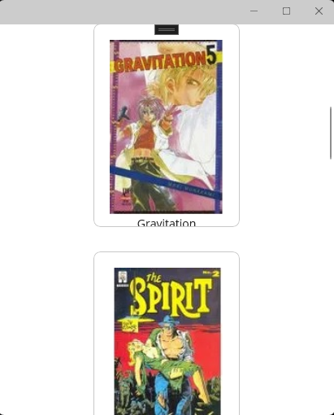

# [.NET MAUI : Apresentando CollectionView - II](https://www.youtube.com/watch?v=687RtN7NrQk)

## ItemsLayout - Definindo layout no CollectionView

* Existem dois tipos de layouts no CollectionView:

1. Listas (VerticalList, HorizontalList) - Listas com colunas ou linhas únicas
2. Grades (VerticalGrid, HorizontalGrid) - Grades com colunas ou linhas

* Os layouts no CollectionView são implementados da seguinte forma:
  
1. Na propriedade **ItemsLayout** da CollectionView, como mostrado no código seguinte:
   
```
<CollectionView ItemsSourcer="{Binding Produtos}"
                ItemsLayout="HorizontalList">
    ...
</CollectionView>
```

2. Customizável, como mostrado no código seguinte:

```
<CollectionView ItemsSourcer="{Binding Produtos}">
    ...

    <CollectionView.ItemsLayout>
	    <LinearItemsLayout Orientation="Horizontal" />	
    </CollectionView.ItemsLayout>

    ....

    <CollectionView.ItemsLayout>
	    <GridItemsLayout Orientation="Vertical" />	
    </CollectionView.ItemsLayout>

    ...
</CollectionView>
```

### Exemplo prático

1. Abra o projeto **MauiCollectionView**, na pasta **Views**, criar o arquivo **LayoutView.xaml**
2. No arquivo **LayoutView.xaml.cs**, crie uma instancia do classe **ProdutoViewModel** para a propriedade **BindingContext**, como mostrado no código a seguir:

```
using MauiCollectionView.MVVM.ViewModels;

namespace MauiCollectionView.MVVM.Views;

public partial class LayoutView : ContentPage
{
	public LayoutView()
	{
		InitializeComponent();
		BindingContext = new ProdutoViewModel();
	}
}
```

3. Edite o arquivo **LayoutView.xaml** da seguinte forma:

```
<?xml version="1.0" encoding="utf-8" ?>
<ContentPage xmlns="http://schemas.microsoft.com/dotnet/2021/maui"
             xmlns:x="http://schemas.microsoft.com/winfx/2009/xaml"
             x:Class="MauiCollectionView.MVVM.Views.LayoutView"
             Title="LayoutView">

    <CollectionView ItemsSource="{Binding Produtos}">
        <CollectionView.ItemTemplate>
            <DataTemplate>
                <Frame  Margin="15" HeightRequest="250" WidthRequest="180">
                    <VerticalStackLayout>
                        <Image Source="{Binding Imagem}" />
                        <Label HorizontalTextAlignment="Center" Text="{Binding Nome}" />
                    </VerticalStackLayout>
                </Frame>
            </DataTemplate>
        </CollectionView.ItemTemplate>
    </CollectionView>
    
</ContentPage>
```

4. Edite o arquivo *App.xaml.cs*, de **MainPage = new ProdutoView();** para **MainPage = new LayoutView();**
   
5. Rode a aplicação e veja o seguinte resultado:

    <p align="center"></p>
   
6. Como pode ser visto a propriedade **ItemsLayout** do **CollectionView** foi omitida. Isso porque o valor padrão é **ItemsLayout="VerticalList"**. 
   
7. Atribua o valor **HorizontalList** e você terá o seguinte resultado:
   
    <p align="center"></p>

8. Para definir Grades, basta de definir o tipo (VerticalGrid, HorizontalGrid), e o número de colunas/linhas.
   
9. Por examplo, defina o ItemsLayout da seguinte forma: ItemsLayout="HorizontalGrid, 3". Você terá o seguinte resultado:

    <p align="center"></p>    

10. A propriedade ItemsLayout pode ser customizada como mostra o código seguinte:
    
```
<?xml version="1.0" encoding="utf-8" ?>
<ContentPage xmlns="http://schemas.microsoft.com/dotnet/2021/maui"
             xmlns:x="http://schemas.microsoft.com/winfx/2009/xaml"
             x:Class="MauiCollectionView.MVVM.Views.LayoutView"
             Title="LayoutView">

    <CollectionView ItemsSource="{Binding Produtos}">
        <CollectionView.ItemTemplate>
            <DataTemplate>
                <Frame  Margin="15" HeightRequest="250" WidthRequest="180">
                    <VerticalStackLayout>
                        <Image Source="{Binding Imagem}" />
                        <Label HorizontalTextAlignment="Center" Text="{Binding Nome}" />
                    </VerticalStackLayout>
                </Frame>
            </DataTemplate>
        </CollectionView.ItemTemplate>

        <CollectionView.ItemsLayout>
            <LinearItemsLayout Orientation="Horizontal" />
        </CollectionView.ItemsLayout>
        
    </CollectionView>
    
</ContentPage>
```

11. Ao rodar a aplicação teremos o seguinte resultado:

<p align="center"></p>    

## CollectionView: Header e Footer

Header e Footer são trabalhados de duas formas: 1. Texto simples; 2. Customizado

1. Texto simples - Um texto simples mostrado no início do texto e no final. 

```
<CollectionView ItemsSource="{Binding Produtos}"
                Header="Lista de produtos"
                Footer="Fim da lista">
```

2. Customizado

```
<CollectionView.Header>
    <Frame  Background="Blue">
        <Label  Text="Lista de produtos"
                TextColor="White"
                HorizontalTextAlignment="Center"
                FontSize="Large" />
    </Frame>
</CollectionView.Header>
<CollectionView.Footer>
    <HorizontalStackLayout  HorizontalOptions="Center">
        <Label  Text="Fim da lista"
                FontAttributes="Bold"
                FontSize="Title" />
    </HorizontalStackLayout>
</CollectionView.Footer>
```

## CollectionView: SelectionMode

Existem três tipos de Seleção de items: None (Padrão); Single; Multiple

### CollectionView: SelectionMode - Single

1. No arquivo **LayoutView.xaml**
   
```
<CollectionView ItemsSource="{Binding Produtos}"
                SelectionMode="Single"
                SelectionChanged="CollectionView_SelectionChanged">

```

2. No arquivo **LayoutView.xaml.cs**

```
private void CollectionView_SelectionChanged(object sender, SelectionChangedEventArgs e)
{
    var anterior = e.PreviousSelection;
    var atual = e.CurrentSelection;
}

```

## CollectionView: EmptyView

1. Propriedade da CollectionView
   
```
<CollectionView ItemsSource="{Binding Produtos}" EmptyView="Sem dados...">
...
</CollectionView>
```

2.Customizado

```
<CollectionView.EmptyView>
	<VerticalStackLayout VerticalOptions="Center">
		<Image Source="semfoto.jpg" />
		<Label	Text="Sem dados"
			FontSize="Large"
			HorizontalTextAlignment="Center"/>
	</VerticalStackLayout>
</CollectionView.EmptyView>
```

<!--
# .NET MAUI : Apresentando CollectionView - II
## ItemsLayout - Definindo layout no CollectionView
### Propriedade ItemsLayout
### Exemplo prático
## CollectionView: Header e Footer
### Texto simples
### Customizado
## CollectionView: SelectionMode
### CollectionView: SelectionMode - Single
## CollectionView: EmptyView


https://github.com/deyran/mobile-maui-training/blob/main/CollectionView/Macoratti/macoratti-collectionview-part2.md
-->