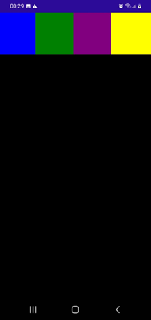

# FlexLayout

<p align="center"></p>

FlexLayout is a layout that can organize its children (Horizontally and Vertically) into stack. It can wrap its children if there are to many to fit in a row or column.

## Direction property and its values

1. Row

```
<FlexLayout Direction="Row">
    <Label Text="Child 1" TextColor="Black" BackgroundColor="AntiqueWhite" />
    <Label Text="Child 2" TextColor="Black" BackgroundColor="Blue" />
    <Label Text="Child 3" TextColor="Black" BackgroundColor="Coral" />
</FlexLayout>
```

<p align="center"></p>

2. Grow, Basis, Order e Shrink

```
<FlexLayout Direction="Column">
    <!--Header-->
    <Label Text="Cabeçalho" 
            FontSize="Large"                 
            BackgroundColor="Aquamarine"
            HorizontalTextAlignment="Center"
            TextColor="Black" />

    <!---Body-->
    <FlexLayout FlexLayout.Grow="1">
        <Label Text="Conteúdo"
                FontSize="Large"
                BackgroundColor="Gray"
                HorizontalTextAlignment="Center"
                VerticalTextAlignment="Center"
                FlexLayout.Grow="1" />
        
        <!---Itens Laterais-->
        <BoxView FlexLayout.Basis="50"
                    FlexLayout.Order="-1"
                    Color="Blue" />

        <BoxView FlexLayout.Basis="50"
                    Color="Green" />

    </FlexLayout>

    <Label Text="RodaPé"
            FontSize="Large"
            BackgroundColor="Yellow"
            TextColor="Black"
            HorizontalTextAlignment="Center" />
</FlexLayout>
```

<p align="center"></p>

<!--
# FlexLayout
## Direction property and its values
### Grow, Basis, Order e Shrink
-->

## References

1. MACORRATI, Jose Carlos. .NET MAUI : Layouts - FlexLayout. YouTube, 02-12-23, https://youtu.be/1W1HqJu_Y6E?si=VIwXmhcgRjrjo0km, 01-12-24.