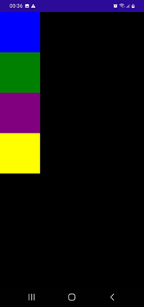

# FlexLayout

<p align="center"></p>

FlexLayout is a layout that can organize its children (Horizontally and Vertically) into stack. It can wrap its children if there are to many to fit in a row or column.

## Direction - Row (default value)

* Code
```
<FlexLayout Direction="Row">
    <BoxView HeightRequest="100" WidthRequest="100" Color="Blue" />
    <BoxView HeightRequest="100" WidthRequest="100" Color="Green" />
    <BoxView HeightRequest="100" WidthRequest="100" Color="Purple" />
    <BoxView HeightRequest="100" WidthRequest="100" Color="Yellow" />
</FlexLayout>
```

* Result

<p align="center"></p>

## Direction - Column

* Code

```
<FlexLayout Direction="Column">
    <BoxView HeightRequest="100" WidthRequest="100" Color="Blue" />
    <BoxView HeightRequest="100" WidthRequest="100" Color="Green" />
    <BoxView HeightRequest="100" WidthRequest="100" Color="Purple" />
    <BoxView HeightRequest="100" WidthRequest="100" Color="Yellow" />
</FlexLayout>
```

* Result

<p align="center"></p>

## Wrap

The **Wrap** property is used to control whether children are arranged on a single line or on multiple lines. Its main values are: **Wrap** (Multiple lines); **NoWrap** (default, Single line)

* Code - Wrap value

```
```

* Result

https://youtu.be/PpTrDDEnHF8?t=32

<!--
# FlexLayout
## Wrap
### Code - Wrap value
-->


2. Grow, Basis, Order e Shrink

```
<FlexLayout Direction="Column">
    <!--Header-->
    <Label Text="Cabeçalho" 
            FontSize="Large"                 
            BackgroundColor="Aquamarine"
            HorizontalTextAlignment="Center"
            TextColor="Black" />

    <!---Body-->
    <FlexLayout FlexLayout.Grow="1">
        <Label Text="Conteúdo"
                FontSize="Large"
                BackgroundColor="Gray"
                HorizontalTextAlignment="Center"
                VerticalTextAlignment="Center"
                FlexLayout.Grow="1" />
        
        <!---Itens Laterais-->
        <BoxView FlexLayout.Basis="50"
                    FlexLayout.Order="-1"
                    Color="Blue" />

        <BoxView FlexLayout.Basis="50"
                    Color="Green" />

    </FlexLayout>

    <Label Text="RodaPé"
            FontSize="Large"
            BackgroundColor="Yellow"
            TextColor="Black"
            HorizontalTextAlignment="Center" />
</FlexLayout>
```

<p align="center"></p>

## References

1. MACORRATI, Jose Carlos. .NET MAUI : Layouts - FlexLayout. YouTube, 02-12-23, https://youtu.be/1W1HqJu_Y6E?si=VIwXmhcgRjrjo0km, 01-12-24.