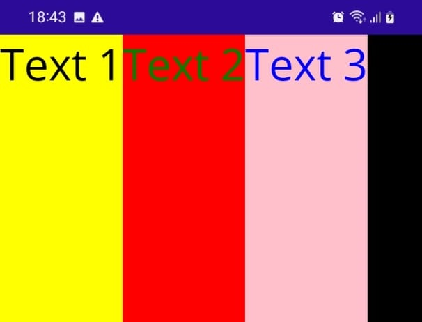

# Layouts - StackLayout, VerticalStackLayout, HorizontalStackLayout

StackLayout is a layout container that allows arrange child views in a linear manner. There are two ways that StackLout allows to stack: vertically or horizontally.

# Vertical

1. The vertical orientation is set as default, as can seen in the code below:

```
<StackLayout>
    <Label Text="Text 1" FontSize="Large" BackgroundColor="Yellow" TextColor="Black" />
    <Label Text="Text 2" FontSize="Large" BackgroundColor="Red" TextColor="Green" />
    <Label Text="Text 3" FontSize="Large" BackgroundColor="Pink" TextColor="Blue" />
</StackLayout>
```

2. Using de VerticalStackLayout you got the same result

```
<VerticalStackLayout>
    <Label Text="Text 1" FontSize="Large" BackgroundColor="Yellow" TextColor="Black" />
    <Label Text="Text 2" FontSize="Large" BackgroundColor="Red" TextColor="Green" />
    <Label Text="Text 3" FontSize="Large" BackgroundColor="Pink" TextColor="Blue" />
</VerticalStackLayout>
```

3. Running the application you will obtain this result

<p align="center"></p>

# Horizontal

1. Setting the Orientation property to Horizontal to change the dimension, as can be seen in the code below

```
<StackLayout Orientation="Horizontal">
    <Label Text="Text 1" FontSize="Large" BackgroundColor="Yellow" TextColor="Black" />
    <Label Text="Text 2" FontSize="Large" BackgroundColor="Red" TextColor="Green" />
    <Label Text="Text 3" FontSize="Large" BackgroundColor="Pink" TextColor="Blue" />
</StackLayout>
```

2. The code below achieves the same result

```
<HorizontalStackLayout>
    <Label Text="Text 1" FontSize="Large" BackgroundColor="Yellow" TextColor="Black" />
    <Label Text="Text 2" FontSize="Large" BackgroundColor="Red" TextColor="Green" />
    <Label Text="Text 3" FontSize="Large" BackgroundColor="Pink" TextColor="Blue" />
</HorizontalStackLayout>
```

3. Running the application you will obtain this result

<p align="center"></p>

<!--
# Layouts - StackLayout, VerticalStackLayout, HorizontalStackLayout
# Horizontal
-->

## Fontes

1. [Macorrati](https://youtu.be/D8gkGd1N8E8?si=VgFw2y10R6U4oz76)