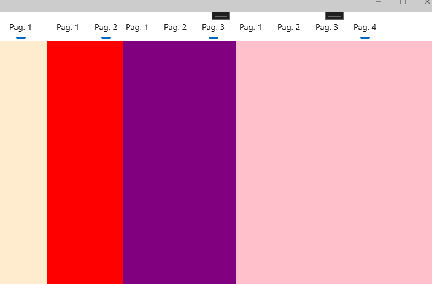
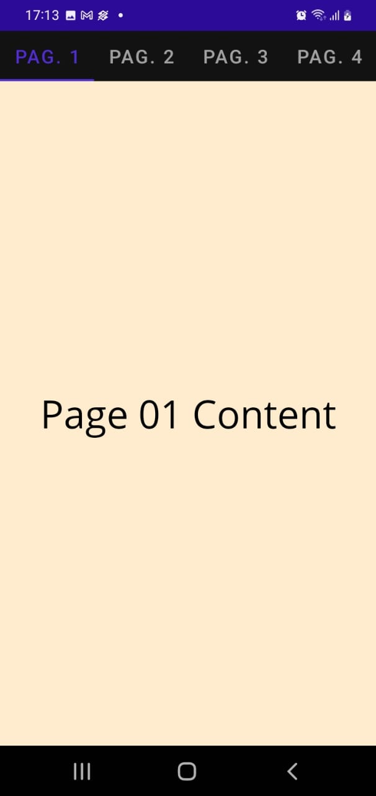
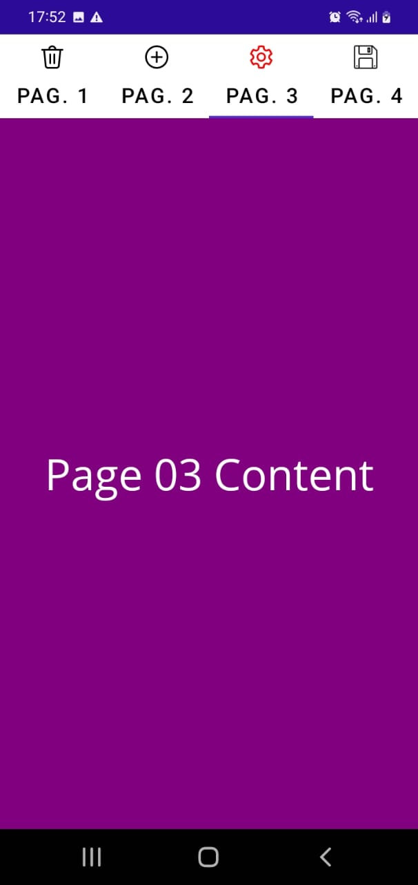

# NET MAUI PAGES

## [ContentPage](https://youtu.be/9D42vT3CzO4?list=PLJ4k1IC8GhW3VlYa0p9QhV98Waka7oghq&t=478)

* Exibe uma única View, ou Grid ou ScrollView ou StackLayout
* Representa o conteúdo da página

### Exemplo prático

1. Crie uma ContentPage, chamado **MinhaPagina.xaml**
2. Edite o arquivo **App.Xaml.cs** para definir **MinhaPagina.xaml** como página principal
   
```
namespace MauiDemoPages
{
    public partial class App : Application
    {
        public App()
        {
            InitializeComponent();
            MainPage = new MinhaPagina();
        }
    }
}
```

## [NavigationPage](https://youtu.be/9D42vT3CzO4?list=PLJ4k1IC8GhW3VlYa0p9QhV98Waka7oghq&t=662)

* Permite navegação pelas páginas de forma hieráquica estilo **Pilha** LIFO
* Último a entrar, primeiro ao sair

### Navegação da página

```
await Navigation.PushAsync(new MainPage());
```

### Remover página da pilha de navegação

Ao clicar no botão voltar (<-) ou usar o seguinte método:

```
await Navigation.PopAsync();
```

### Exemplo prático

1. Edite o arquivo **App.xaml.cs** crie a pilha, como mostrado no código seguinte:

```
namespace MauiDemoPages
{
    public partial class App : Application
    {
        public App()
        {
            InitializeComponent();
            MainPage = new NavigationPage(new MinhaPagina());
        }
    }
}
```

2. Edite o arquivo **MinhaPagina.xaml** da seguinte forma:

```
<Button Text="Navegar para outra Página"
        HorizontalOptions="Center" 
        Clicked="Button_Clicked" />
```

3. Edite o arquivo **MinhaPagina.xaml.cs** da seguinte forma:

```
private async Task Button_ClickedAsync(object sender, EventArgs e)
{
    await Navigation.PushAsync(new MainPage());
}
```

## [FlyoutPage](https://youtu.be/T3HPTy86rU4?list=PLJ4k1IC8GhW3VlYa0p9QhV98Waka7oghq)

* Trata da relação Submenu e detalhes
* Propriedade Title é obrigatória

### Exemplo prático

1. Crie ContentPage (XAML), com nome **FlyoutPageDemo.xaml**
2. No arquivo **FlyoutPageDemo.xaml** troque ContentPage para FlyoutPage, como mostra o código abaixo:

```
<?xml version="1.0" encoding="utf-8" ?>
<FlyoutPage xmlns="http://schemas.microsoft.com/dotnet/2021/maui"
             xmlns:x="http://schemas.microsoft.com/winfx/2009/xaml"
             x:Class="MauiDemoPages.FlyoutPageDemo"
             Title="FlyoutPageDemo">

    ...

</FlyoutPage>
```

3. No arquivo **FlyoutPageDemo.xaml.cs** troque ContentPage para FlyoutPage
   
4. No arquivo **FlyoutPageDemo.xaml** coleque o seguinte código:

```
<FlyoutPage.Flyout>
    <ContentPage Title="Flyout Submenu" BackgroundColor="Aquamarine">
        <Label Text="Submenu"
               FontSize="Large"
               HorizontalTextAlignment="Center" 
               VerticalTextAlignment="Center"/>
    </ContentPage>
</FlyoutPage.Flyout>
<FlyoutPage.Detail>
    <ContentPage BackgroundColor="Yellow">
        <Label Text="Detalhes" 
            FontSize="Large"
            HorizontalTextAlignment="Center" 
            VerticalTextAlignment="Center" />    
    </ContentPage>
</FlyoutPage.Detail>
```

5. Coloque FlyoutPageDemo como página principal

## [TabbedPage](https://youtu.be/T3HPTy86rU4?list=PLJ4k1IC8GhW3VlYa0p9QhV98Waka7oghq&t=542)

**TabbedPage** é uma classe que mantém uma coleção de filhos do tipo **Page**. Cada filho é identificado por uma série de guias na parte superior ou inferior. Normalmente, cada filho será um **ContentPage** e quando sua guia é selecionada, o conteúdo da página é exibido.

### Exemplo prático

#### Configurações iniciais

1. Crie um novo arquivo ".NET MAUI ContentPage (XAML)" chamado **TabbedPageDemo.xaml**
2. Ainda no arquivo **TabbedPageDemo.xaml**, troque **ContentPage** por **TabbedPage**. 
3. Faça o mesmo no arquivo **TabbedPageDemo.xaml.cs**
4. No arquivo **App.xaml.cs**, instancie a classe **TabbedPageDemo** no **MainPage**

#### Exemplo Simples

1. Edit o arquivo **TabbedPageDemo.xaml** da seguinte forma:

```
<?xml version="1.0" encoding="utf-8" ?>
<TabbedPage xmlns="http://schemas.microsoft.com/dotnet/2021/maui"
             xmlns:x="http://schemas.microsoft.com/winfx/2009/xaml"
             x:Class="MauiDemoPages.TabbedPageDemo"
             Title="TabbedPageDemo">

    <ContentPage Title="Pag. 1" BackgroundColor="BlanchedAlmond"></ContentPage>
    <ContentPage Title="Pag. 2" BackgroundColor="Red"></ContentPage>
    <ContentPage Title="Pag. 3" BackgroundColor="Purple"></ContentPage>
    <ContentPage Title="Pag. 4" BackgroundColor="Pink"></ContentPage>

</TabbedPage>
```

2. Execute a aplicação e veremos o seguinte resultado:

<p align="center"></p>   

#### Cor de fundo e Conteúdo

1. Edit o arquivo **TabbedPageDemo.xaml** da seguinte forma:

```
<?xml version="1.0" encoding="utf-8" ?>
<TabbedPage xmlns="http://schemas.microsoft.com/dotnet/2021/maui"
             xmlns:x="http://schemas.microsoft.com/winfx/2009/xaml"
             x:Class="MauiDemoPages.TabbedPageDemo"
             Title="TabbedPageDemo">

    <ContentPage Title="Pag. 1" BackgroundColor="BlanchedAlmond">
        <Label Text="Page 01 Content"
               TextColor="Black"
               FontSize="Large"
               HorizontalTextAlignment="Center"
               VerticalTextAlignment="Center" />
    </ContentPage>
    <ContentPage Title="Pag. 2" BackgroundColor="Red">
        <Label Text="Page 02 Content"
               FontSize="Large"
               HorizontalTextAlignment="Center"
               VerticalTextAlignment="Center" />
    </ContentPage>
    <ContentPage Title="Pag. 3" BackgroundColor="Purple">
        <Label Text="Page 03 Content"
               FontSize="Large"
               HorizontalTextAlignment="Center"
               VerticalTextAlignment="Center" />
    </ContentPage>
    <ContentPage Title="Pag. 4" BackgroundColor="Pink">
        <Label Text="Page 04 Content"
               FontSize="Large"
               HorizontalTextAlignment="Center"
               VerticalTextAlignment="Center" />
    </ContentPage>
</TabbedPage>
```

2. Execute a aplicação e veremos o seguinte resultado:

<p align="center"></p>

#### Ícones das Abas

1. Os ícones ficam na pasta **Resources/Images**
2. Os ícones vieram do site **icons8.com/icons**
3. Para usar os ícones no ContentPage basta usar a propriedade **IconImageSource**, como mostrado no código abaixo:

```
...

<ContentPage Title="Pag. 1" IconImageSource="trash.png" ...

...
```

4. Para alterar a cor de fundo e cor da fonte das guias são usadas as propriedades **BarBackgroundColor** e **BarTextColor**. Já as cores do ícones selecionados ou não selecionados, se usa as propriedades **SelectedTabColor** e **UnSelectedTabColor**. O código seguinte mostra o uso dessas propriedades:

```
...
<TabbedPage ...
            BarBackgroundColor="White"
            BarTextColor="Black"            
            SelectedTabColor="Blue"
            UnselectedTabColor="Black"
            ...>
...
```

5. Execute a aplicação e veremos o seguinte resultado:

<p align="center"></p>

<!--
# NET MAUI PAGES
## TabbedPage
### Exemplo prático
#### Ícones das Abas
-------------------------

# NET MAUI PAGES
## ContentPage
### Exemplo prático
## NavigationPage
### Navegação da página
### Remover página da pilha de navegação
### Exemplo prático
## FlyoutPage
### Exemplo prático
## TabbedPage
### Exemplo prático
#### Configurações iniciais
#### Exemplo Simples
#### Cor de fundo e Conteúdo
#### Ícones das Abas
-->